<!-- The art in assets/ is generated. Edit _build/build.py, then run: python _build/build.py -->

<a href="https://kindamad.pages.dev/about"></a>

  
  <a href="https://kindamad.pages.dev">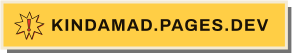</a>
  
   
  
  <a href="https://www.instagram.com/kinda_mad.balls/">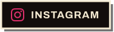</a>
  <a href="https://discord.gg/tkaub8twjb">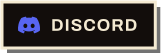</a>
  <a href="https://x.com/KindaMADballs">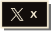</a>
  <a href="https://kindamad.itch.io/">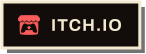</a>
  <a href="https://www.linkedin.com/in/madhav-gangneja-9aa265312/">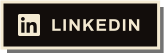</a>

I'm Madhav, a content creator turned game developer from India and the one-person studio behind <b>KindaMAD Studios</b>. 
I make loud, hand-made games and build them in public, in front of an audience that ran up over 200 million views in the last year.


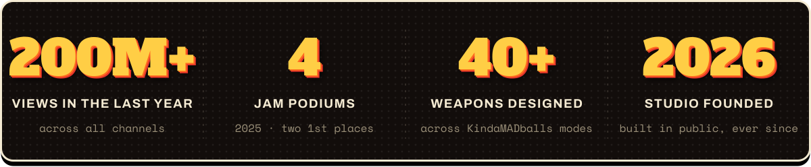


  <a href="https://kindamad.pages.dev/balls"></a>
  <a href="https://kindamad.pages.dev/radiation"></a>
  <a href="https://kindamad.pages.dev/rayban-tour"></a>
  <a href="https://www.youtube.com/@KindaMADballs"></a>


  <a href="https://kindamad.itch.io/leftbroken">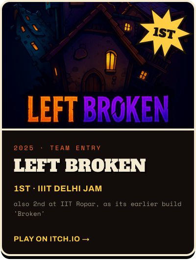</a>
  <a href="https://kindamad.itch.io/shadows-of-bhangarh">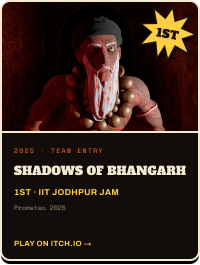</a>
  <a href="https://kindamad.itch.io/third-law">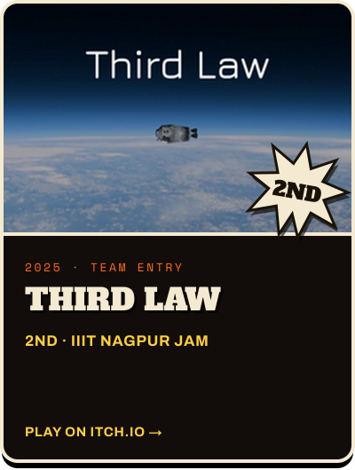</a>

Every one of these was a team effort, made with some of my closest friends, and the wins are every bit as much theirs. 
Source: <a href="https://github.com/KindaMAD-hav/Shadow-of-Bhangarh">Shadows of Bhangarh</a> · <a href="https://github.com/KindaMAD-hav/WeightlessBond">Third Law</a> · <a href="https://github.com/KindaMAD-hav/bRoKeN_SleepDeprived_Advitya25">Broken</a> · <a href="https://github.com/KindaMAD-hav/TimeBound">TimeBound</a> (GMTK 2025)


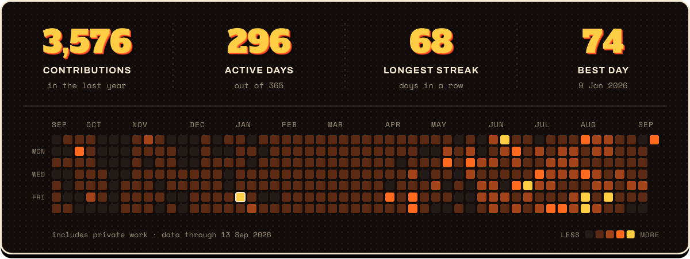


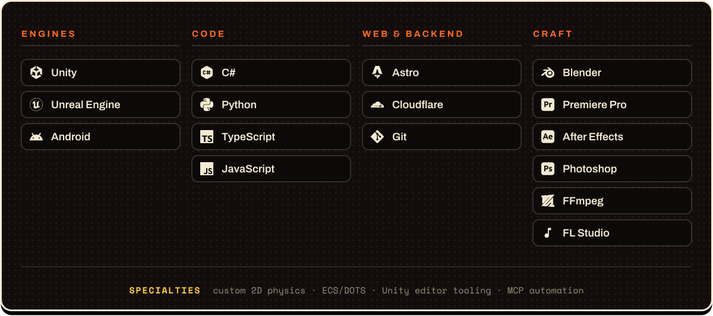

<a href="https://kindamad.pages.dev/work#inquiry"></a>

We make games that are <b>kinda mad.</b>

